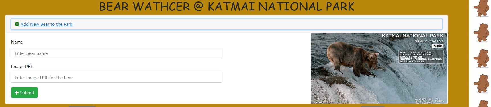

# Bear-Watcher

 Each year between July and September brown bears in the Katmai National Park congregate along the Brooks River. This river is one of the main rivers that Sockeye Salmon swim up to spawn. The brown bears wait in the shallows of the river and catch the salmon as they jump over rocks.

## Technical Used

* Boostrap 4 to style the page components.
* JS file comprised of functions.
* Using ES6 modules

## Feature List
* Show the Best on the landing page.
* Add new Bear.
* River Side button to show all bears.
* Catch Fish button to start having fun when do that.
* Very cool bear in action when you catching fish.
* tracking those fish after click.
* getting the rewards every time you want with recording the history.

## Screenshots

**Home Page - Landing Page**

**River Side show all bears**

**Bear in Action when catching fish**

**Bear in Action when didn't catched fish**

**Rewards Bears**

**Adding new bear**

## How To Run

1. Clone down this repo
2. Use your favorite http server (like live server) ti serve it up (hs)
3. in your browser, go where it's bieng served (default is localhost:8081)
